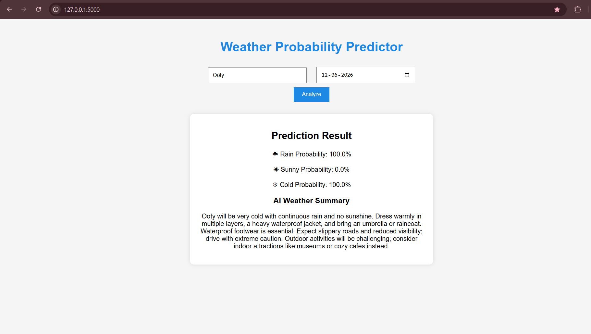

# Weather Probability Predictor

## Screenshot



A Flask-based weather analysis application...

A Flask-based weather analysis application that predicts:

* Rain Probability
* Sunny Probability
* Cold Weather Probability

using historical weather data from Open-Meteo APIs.

## Features

* Historical weather analysis
* Probability calculations
* AI-generated weather summaries
* Clean Flask web interface

## Technologies

* Python
* Flask
* Open-Meteo API
* Gemini AI
* HTML/CSS

## Run Locally

```bash
pip install -r requirements.txt
python app.py
```

Open:

http://127.0.0.1:5000
